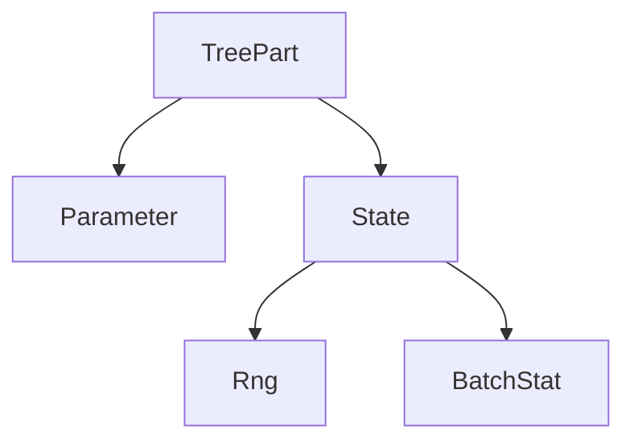

# Treex

_A simple pure PyTree Module system for JAX_

* **Simple and Intuitive**: Modules are simple Python objects that respect Object Oriented semantics and should make PyTorch users feel at home, no need for separate dictionary structures or complex `apply` methods.
* **PyTree-based**: Modules are registered as JAX PyTrees so they can be used with any JAX function, no need for special versions of `jit`, `grad`, `vmap`, etc.
* **Expressive**: By using type annotations you can tell Treex what the different parts of your module do, this leads to a very powerful state management solution.
* **Doesn't reinvent the wheel**: Writting high-quality, battle-tested code for common layers is hard, so currently Modules in `treex.nn` are wrappers over their **Flax** counterparts, they keep the same signatures so Flax users feel at home but still grant them the simple Pytorch-like behavior Treex brings.

## Why Treex?
Despite all JAX benefits, current Module systems are not intuitive to new users and add additional complexity not present in frameworks like PyTorch or Keras. Treex takes insparation from S4TF and delivers an intuitive experience using JAX PyTree infrastructure.

<details>
<summary>Current Alternative's Drawbacks and Solutions</summary>

Currently we have many alternatives like Flax, Haiku, Objax, that have one or more of the following drawbacks:

* Module structure and parameter structure are separate, parameters have to be manipulated around by the user which is not intuitive. In Treex, parameters are stored in the modules themselves and can be accessed directly.
* Monadic architecture's add complexity, both Flax and Haiku use an `apply` method to call modules which sets a context with parameters, rng, etc, which add an additional overhead to the API and creates an asymmetry to how Modules are used inside and outside a context. In Treex you can just call the modules directly.
* Parameter surgery is very difficult to implement, if you want to transfer a pretrained module or submodule as part of a new module, you have to know precisely how to extract their parameters and how to insert them into the new parameter structure / dictionaries such that it is in agreement with the new module structure. In Treex, just as in PyTorch / Keras you just pass the (sub)module to the new module and parameters go with them.
* Deviate from JAX semantics and require special versions of `jit`, `grad`, `vmap`, etc, which makes it harder to integrate with other JAX libraries. Treex's Modules are plain old JAX PyTrees and are compatible with any JAX library that supports them.
* Other PyTree-based approaches like Parallax and Equinox don't have a full state management solution to handle complex state as you see in Flax. Treex has the Filter and Update API that is very expressive and can effectively handle systems with complex state.

</details>

## Installation
Install using pip:
```bash
pip install treex
```

## Status
While its core API is probably near complete, Treex right now its more of a proof of concept for what a PyTree-based Module system for JAX could look like. More testing is needed to find out wether its general enough for complex models and potential issues. Feedback is appriciated.

**Roadmap**:
- [x] Finish prototyping core API
- [ ] Wrap all Flax Linen Modules
- [ ] Document public API
- [ ] Create documentation site


## Getting Started
This is a small appetizer to give you a feel for how using Treex looks like, be sure to checkout the [Guide section](#guide) below for details on more advanced usage.
```python
from typing import Sequence, List

import jax
import jax.numpy as jnp
import numpy as np
import treex as tx


class MLP(tx.Module):
    layers: List[tx.Linear]

    def __init__(self, features: Sequence[int]):
        self.layers = [
            tx.Linear(din, dout) 
            for din, dout in zip(features[:-1], features[1:])
        ]

    def __call__(self, x):
        for linear in self.layers[:-1]:
            x = jax.nn.relu(linear(x))
        return self.layers[-1](x)


model = MLP([1, 12, 8, 1]).init(42)

x = np.random.uniform(-1, 1, size=(100, 1))
y = 1.4 * x ** 2 - 0.3 + np.random.normal(scale=0.1, size=(100, 1))

@jax.jit
@jax.grad
def loss_fn(model, x, y):
    y_pred = model(x)
    return jnp.mean((y_pred - y) ** 2)

# in reality use optax
def sdg(param, grad):
    return param - 0.01 * grad

# training loop
for step in range(10_000):
    grads = loss_fn(model, x, y)
    model = jax.tree_map(sdg, model, grads)

model = model.eval()
y_pred = model(x)
```

## Guide
### Defining Modules
Treex Modules have the following characteristics:
* They inherit from `tx.Module`.
* Fields for parameter and submodule **MUST** be marked using a _valid_ type annotation.


```python
class Linear(tx.Module):
    w: tx.Parameter
    b: tx.Parameter

    def __init__(self, din, dout):
        self.w = tx.Initializer(
            lambda key: jax.random.uniform(key, shape=(din, dout)))
        self.b = jnp.zeros(shape=(dout,))

    def __call__(self, x):
        return jnp.dot(x, self.w) + self.b

linear = Linear(3, 5).init(42)
y = linear(x)
```

Valid type annotations include:
* Subtypes of `tx.TreePart` e.g. `tx.Parameter`, `tx.BatchStat`, etc.
* Subtypes of `tx.Module` e.g. `tx.Linear`, custom Module types, etc.
* Generic subtypes from the `typing` module of the previous e.g. `List[tx.Parameter]` or `Dict[str, tx.Linear]`.

Type annotations that do not comform to the above rules will be ignored and the field will not be counted as part of the PyTree.

```python
class MLP(tx.Module):
    layers: List[tx.Linear]

    def __init__(self, features: Sequence[int]):
        self.layers = [
            tx.Linear(din, dout) 
            for din, dout in zip(features[:-1], features[1:])
        ]

    def __call__(self, x):
        for linear in self.layers[:-1]:
            x = jax.nn.relu(linear(x))
        return self.layers[-1](x)

mlp = MLP([3, 5, 2]).init(42)
```

### Pytrees
Since Modules are pytrees they can be arguments to JAX functions such as `jit`, `grad`, `vmap`, etc, and the `jax.tree_*` function family.
```python
@jax.jit
@jax.grad
def loss_fn(model, x, y):
    y_pred = model(x)
    return jnp.mean((y_pred - y) ** 2)

def sdg(param, grad):
    return param - 0.01 * grad

model = MLP(...).init(42)

grads = loss_fn(model, x, y)
model = jax.tree_map(sdg, model, grads)
```
This makes Treex Modules compatible with tooling from the JAX ecosystem, and enables correct unification of Modules as both the parameter containers and the definition of the foward computation.

### Initialization
Initialization in Treex is done by calling the `init` method on the Module with a seed, this returns a new Module with all fields initialized.

There are two initialization mechanisms in Treex, the first is setting the fields you wish to initialize to an `Initializer` object. `Initializer`s contain functions that take a `key` and return the initial value of the field:
```python
class MyModule(tx.Module):
    a: tx.Parameter
    b: tx.Parameter

    def __init__(self):
        self.a = tx.Initializer(
            lambda key: jax.random.uniform(key, shape=(1,)))
        self.b = 2

module = MyModule() 
module # MyModule(a=Initializer, b=2)
moduel.initialized # False

module = module.init(42)  
module # MyModule(a=array([0.034...]), b=2)
module.initialized # True
```
The second is to use override the `module_init` which takes a `key` and can initialized any required fields. This is useful for modules that require complex initialization logic or whose fields initialization depend on each other.
```python
class MyModule(tx.Module):
    a: tx.Parameter
    b: tx.Parameter

    def __init__(self):
        self.a = None
        self.b = None

    def module_init(self, key):
        # some complex initialization
        ...

module = MyModule().init(42)
module # MyModule(a=array([0.927...]), b=array([0.749...]))
```
You can also mix and match the two strategies, meaning that some parameters can be initialized via `Initializer`s while others via `module_init`. The rule is that `Initializer`s are always going the be called first.


### Filter and Update API
The `filter` method allows you to select a subtree by filtering based on a type, all leaves that are not a subclass of such type are set to a special `Nothing` value.
```python
class MyModule(tx.Module):
    a: tx.Parameter = np.array(1)
    b: tx.BatchStat = np.array(2)
    ...

module = MyModule(...)

module.filter(tx.Parameter) # MyModule(a=array([1]), b=Nothing)
module.filter(tx.BatchStat) # MyModule(a=Nothing, b=array([2]))
```
`Nothing` much like `None` is an empty pytree so it gets ignored by tree operations:

```python
jax.tree_leaves(module.filter(tx.Parameter)) # [array([1])]
jax.tree_leaves(module.filter(tx.BatchStat)) # [array([2])]
```

A typical use case is to define `params` as a `Parameter` filter and pass it as the first argument to `grad` so that the gradient is computed only that subset and immediately update them back to the `model` before performing any computation:

```python
# we take `params` as a Parameter filter from model
# but model itself is left untouched
params = model.filter(tx.Parameter)

@jax.grad 
def loss_fn(params, model, x, y):
    # update traced arrays by `grad` from `params`
    model = model.update(params)
    ...

grads = loss_fn(params, model, x, y) 

optimizer = optax.adam(1e-3)
opt_state = optimizer.init(params) # only needs params
```

### State Management
Treex takes a "direct" approach to state management, that is, state is updated inplace by the Module when ever it needs to. For example, this module will calculate the running average of its input:
```python
class Average(tx.Module):
    count: tx.State
    total: tx.State

    def __init__(self):
        self.count = jnp.array(0)
        self.total = jnp.array(0.0)

    def __call__(self, x):
        self.count += np.prod(x.shape)
        self.total += jnp.sum(x)

        return self.total / self.count
```
Treex Modules that require random state will often keep a `rng` key internally and update it inplace when needed:
```python
class Dropout(tx.Module):
    rng: tx.Rng

    def __init__(self, rate: float):
        self.rng = tx.Initializer(lambda key: key)
        ...

    def __call__(self, x):
        key, self.rng = jax.random.split(self.rng)
        ...
```
State management is the hardest thing in JAX but here it seems effortless, what is the catch? The thing you have to worry about is how to propagate changes in state properly taking into account the fact that pytree operations create new objects, that is, reference don't persist across calls throught these functions. 

The solution to this problem is: **always output the module to update state**. For example, a typical loss function that contains stateful model would look like this:

```python
@partial(jax.value_and_grad, has_aux=True)
def loss_fn(params, model, x, y):
    model = model.update(params)

    y_pred = model(x)
    loss = jnp.mean((y_pred - y) ** 2)

    return loss, model

params = model.filter(tx.Parameter)
(loss, model), grads = loss_fn(params, model, x, y)
...
```
Here `model` is returned along with the loss through `value_and_grad` to update `model` on the outside.


### Training State
Treex Modules have a `training: bool` property that specifies whether the module is in training mode or not. This property conditions the behavior of Modules such as `Dropout` and `BatchNorm` which behave differently between training and evaluation. 

To switch between modes use the `.train()` and `.eval()` methods, they return a new Module whose `training` state and the state of all of its submodules (recursively) are set to the desired value.

```python
# training loop
for step in range(1000):
    loss, model, opt_state = train_step(model, x, y, opt_state)

# prepare for evaluation
model = model.eval()

# make predictions
y_pred = model(X_test)
```
### Parameter Annotations
The role of each parameter is defined by its annotation. While valid annotations is any type which inherits from `tx.TreePart`, the default annotations from Treex are currently organized into the following type hierarchy:

<details>
<summary>Graph code</summary>



</details>


This is useful because you can make specific or more general queries using `filter` depending on what you want to achive. E.g.

```python
rngs = model.filter(tx.Rng)
batch_stats = model.filter(tx.BatchStat)
all_states = model.filter(tx.State) # union of the previous two
```
You can easily define you own annotations by inheriting from directly `tx.TreePart` or any of its subclasses. As an example lets create a new `Cache` state to emulates Flax's `cache` collection:

```python
class Cache(tx.TreePart):
    pass
```
That is it! Now you can use it in your model:
```python
class MyModule(tx.Module):
    memory: Cache
    ...
```
**Tip**: Your static analyzer will probably start complaining if you try to assign an `jnp.ndarray` to `memory` in this example because `ndarray`s are not `TreePart`s. While this makes sense, we want to trick the static analyzer into thinking `Cache` represents an `ndarray` and not a `TreePart`, the easiest way to do this is to use `typing.cast`:

```python
from typing import cast, Type
import jax.numpy as jnp

class Cache(tx.TreePart):
    pass

Cache = cast(Type[jnp.ndarray], Cache)
```
`cast` an identity function, meaning `Cache` is actually reassigned to itself, however, the static analyzer will now think its an `ndarray`. This way both the static analyzer and Treex will be happy.

### Full Example

```python
from functools import partial
import jax
import jax.numpy as jnp
import matplotlib.pyplot as plt
import numpy as np
import optax
import treex as tx

x = np.random.uniform(size=(500, 1))
y = 1.4 * x - 0.3 + np.random.normal(scale=0.1, size=(500, 1))

# treex already defines tx.Linear but we can define our own
class Linear(tx.Module):
    w: tx.Parameter
    b: tx.Parameter

    def __init__(self, din, dout):
        self.w = tx.Initializer(lambda key: jax.random.uniform(key, shape=(din, dout)))
        self.b = jnp.zeros(shape=(dout,))

    def __call__(self, x):
        return jnp.dot(x, self.w) + self.b


model = Linear(1, 1).init(42)
optimizer = optax.adam(0.01)

opt_state = optimizer.init(model.filter(tx.Parameter))


@partial(jax.value_and_grad, has_aux=True)
def loss_fn(params, model, x, y):
    model = model.update(params)

    y_pred = model(x)
    loss = jnp.mean((y_pred - y) ** 2)

    return loss, model


@jax.jit
def train_step(model, x, y, opt_state):
    params = model.filter(tx.Parameter)
    (loss, model), grads = loss_fn(params, model, x, y)

    updates, opt_state = optimizer.update(grads, opt_state, model)
    new_params = optax.apply_updates(params, updates)

    model = model.update(new_params)

    return loss, model, opt_state


for step in range(1000):
    loss, model, opt_state = train_step(model, x, y, opt_state)
    if step % 100 == 0:
        print(f"loss: {loss:.4f}")

model = model.eval()

X_test = np.linspace(x.min(), x.max(), 100)[:, None]
y_pred = model(X_test)

plt.scatter(x, y, c="k", label="data")
plt.plot(X_test, y_pred, c="b", linewidth=2, label="prediction")
plt.legend()
plt.show()
```