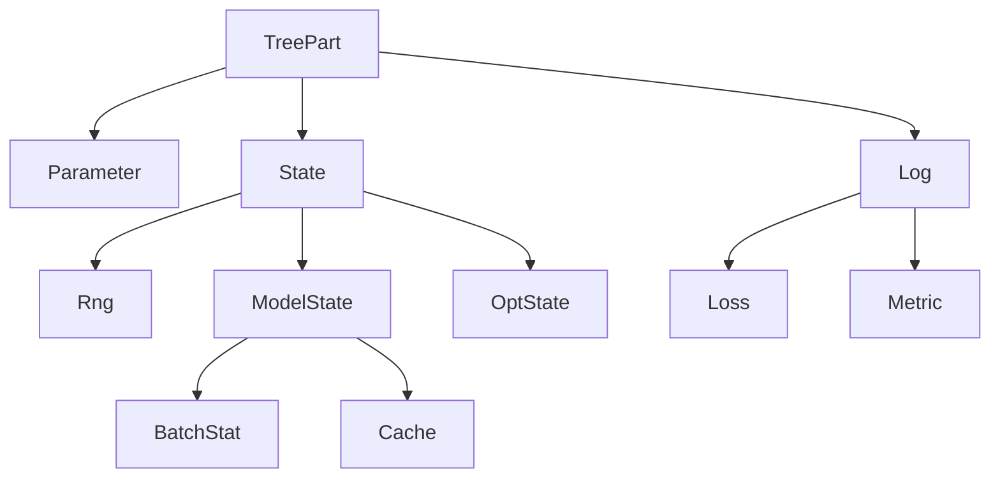
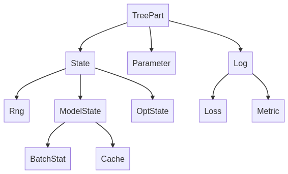

# Treex

_A Pytree-based Module system for Deep Learning in JAX_

* **Intuitive**: Modules are simple Python objects that respect Object-Oriented semantics and should make PyTorch users feel at home, with no need for separate dictionary structures or complex `apply` methods.
* **Pytree-based**:  Modules are registered as JAX PyTrees, enabling their use with any JAX function. No need for specialized versions of `jit`, `grad`, `vmap`, etc.
* **Expressive**: In Treex you use type annotations to define what the different parts of your module represent (submodules, parameters, batch statistics, etc), this leads to a very flexible and powerful state management solution.
* **Flax-based Implementations**: Writing high-quality, battle-tested code for common layers is hard. For this reason Modules in `treex.nn` are wrappers over their Flax counterparts. We keep identical signatures, enabling Flax users to feel at home but still benefiting from the simpler Pytorch-like experience Treex brings.

[Documentation](https://cgarciae.github.io/treex) | [Guide](#guide)

## Why Treex?
Despite all JAX benefits, current Module systems are not intuitive to new users and add additional complexity not present in frameworks like PyTorch or Keras. Treex takes inspiration from S4TF and delivers an intuitive experience using JAX Pytree infrastructure.

<details>
<summary>Current Alternative's Drawbacks and Solutions</summary>

Currently we have many alternatives like Flax, Haiku, Objax, that have one or more of the following drawbacks:

* Module structure and parameter structure are separate, and parameters have to be manipulated around by the end-user, which is not intuitive. In Treex, parameters are stored in the modules themselves and can be accessed directly.
* Monadic architecture adds complexity. Flax and Haiku use an `apply` method to call modules that set a context with parameters, rng, and different metadata, which adds additional overhead to the API and creates an asymmetry in how Modules are being used inside and outside a context. In Treex, modules can be called directly.
* Among different frameworks, parameter surgery requires special consideration and is challenging to implement. Consider a standard workflow such as transfer learning, transferring parameters and state from a  pre-trained module or submodule as part of a new module; in different frameworks, we have to know precisely how to extract their parameters and how to insert them into the new parameter structure/dictionaries such that it is in agreement with the new module structure. In Treex, just as in PyTorch / Keras, we enable to pass the (sub)module to the new module, and parameters are automatically added to the new structure.
* Multiple frameworks deviate from JAX semantics and require particular versions of `jit`, `grad`, `vmap`, etc., which makes it harder to integrate with other JAX libraries. Treex's Modules are plain old JAX PyTrees and are compatible with any JAX library that supports them.
* Other Pytree-based approaches like Parallax and Equinox do not have a total state management solution to handle complex states as encountered in Flax. Treex has the Filter and Update API, which is very expressive and can effectively handle systems with a complex state.

</details>

## Installation
Install using pip:
```bash
pip install treex
```

## Status
Treex is in an early stage, things might brake between versions but we will respect semanting versioning. While more testing is needed, since Treex layers are numerically equivalent to Flax this borrows some maturity and yields more confidence over its results. Feedback is much appreciated.

**Roadmap**:
- [x] Finish prototyping core API
- [ ] Wrap all Flax Linen Modules
- [x] Document public API
- [x] Create documentation site


## Getting Started
This is a small appetizer to give you a feel for how using Treex looks like, be sure to checkout the [Guide section](#guide) below for details on more advanced usage.
```python
from typing import Sequence, List

import jax
import jax.numpy as jnp
import numpy as np
import treex as tx

# you can use tx.MLP but we will create our own as an example
class MLP(tx.Module):
    layers: List[tx.Linear]

    def __init__(self, features: Sequence[int]):
        super().__init__()
        self.layers = [
            tx.Linear(din, dout) 
            for din, dout in zip(features[:-1], features[1:])
        ]

    def __call__(self, x):
        for linear in self.layers[:-1]:
            x = jax.nn.relu(linear(x))
        return self.layers[-1](x)


model = MLP([1, 12, 8, 1]).init(42)

x = np.random.uniform(-1, 1, size=(100, 1))
y = 1.4 * x ** 2 - 0.3 + np.random.normal(scale=0.1, size=(100, 1))

@jax.jit
@jax.grad
def loss_fn(model, x, y):
    y_pred = model(x)
    return jnp.mean((y_pred - y) ** 2)

# in reality use optax
def sdg(param, grad):
    return param - 0.01 * grad

# training loop
for step in range(10_000):
    grads = loss_fn(model, x, y)
    model = jax.tree_map(sdg, model, grads)

model = model.eval()
y_pred = model(x)
```

## Guide
### Defining Modules
Treex Modules have the following characteristics:
* They inherit from `tx.Module`.
* Fields for parameter and submodules **MUST** be marked using a _valid_ type annotation.


```python
class Linear(tx.Module):
    w: tx.Parameter[tx.Initializer, jnp.ndarray]
    b: tx.Parameter[jnp.ndarray]

    def __init__(self, din, dout):
        super().__init__()
        self.w = tx.Initializer(
            lambda key: jax.random.uniform(key, shape=(din, dout)))
        self.b = jnp.zeros(shape=(dout,))

    def __call__(self, x):
        return jnp.dot(x, self.w) + self.b

linear = Linear(3, 5).init(42)
y = linear(x)
```

Valid type annotations include:
* Subtypes of `tx.TreePart` e.g. `tx.Parameter`, `tx.BatchStat`, etc.
* Subtypes of `tx.Module` e.g. `tx.Linear`, custom Module types, etc.
* Generic subtypes from the `typing` module containing `TreeObject` subtypes e.g. `List[tx.Linear]` or `Dict[str, tx.Conv]`.
* Generic types cannot contain `tx.TreePart` subtypes e.g. this is not allowed `Tuple[int, tx.Parameter[float]]`.

Fields with annotations that do not comform to the above rules will be counted as static or yield an error when invalid.

```python
class MLP(tx.Module):
    layers: List[tx.Linear]

    def __init__(self, features: Sequence[int]):
        super().__init__()
        self.layers = [
            tx.Linear(din, dout) 
            for din, dout in zip(features[:-1], features[1:])
        ]

    def __call__(self, x):
        for linear in self.layers[:-1]:
            x = jax.nn.relu(linear(x))
        return self.layers[-1](x)

mlp = MLP([3, 5, 2]).init(42)
```

#### Auto-annotations
Adding all proper type annotations for complex modules can be tedious if you have many submodules, for this reason, Treex will automatically detect all fields whose values are `TreeObject` instances and add the the type annotation for you.

```python
class CNN(tx.Module):

    # Given the fields bellow, these annotations will be added automatically:
    # ----------------------
    # conv1: tx.Conv
    # bn1: tx.BatchNorm
    # dropout1: tx.Dropout
    # conv2: tx.Conv
    # bn2: tx.BatchNorm
    # dropout2: tx.Dropout

    def __init__(self):
        super().__init__()
        self.conv1 = tx.Conv(28, 32, [3, 3])
        self.bn1 = tx.BatchNorm(32)
        self.dropout1 = tx.Dropout(0.5)
        self.conv2 = tx.Conv(32, 64, [3, 3])
        self.bn2 = tx.BatchNorm(64)
        self.dropout2 = tx.Dropout(0.5)
```

Note that this won't work if you have a field with e.g. a list/dict of Modules, for that you have to use proper type annotations.

### Pytrees
Since Modules are pytrees they can be arguments to JAX functions such as `jit`, `grad`, `vmap`, etc, and the `jax.tree_*` function family.

```python
@jax.jit
@jax.grad
def loss_fn(model, x, y):
    y_pred = model(x)
    return jnp.mean((y_pred - y) ** 2)

def sdg(param, grad):
    return param - 0.01 * grad

model = MLP(...).init(42)

grads = loss_fn(model, x, y)
model = jax.tree_map(sdg, model, grads)
```
This makes Treex Modules compatible with tooling from the broader JAX ecosystem, and enables correct unification of Modules as both parameter containers and the definition of the foward computation.

### Initialization
Initialization in Treex is done by calling the `init` method on the Module with a seed. This returns a new Module with all fields initialized.

There are two initialization mechanisms in Treex. The first one is setting the fields we wish to initialize to an `Initializer` object. `Initializer`s contain functions that take a `key` and return the initial value of the field:
```python
class MyModule(tx.Module):
    a: tx.Parameter[tx.Initializer, jnp.ndarray]
    b: tx.Parameter[int]

    def __init__(self):
        super().__init__()
        self.a = tx.Initializer(
            lambda key: jax.random.uniform(key, shape=(1,)))
        self.b = 2

module = MyModule() 
module # MyModule(a=Initializer, b=2)
moduel.initialized # False

module = module.init(42)  
module # MyModule(a=array([0.034...]), b=2)
module.initialized # True
```
The second is to override the `module_init` method, which takes a `key` and can initialize any required fields. This is useful for modules that require complex initialization logic or whose field's initialization depends on each other.
```python
class MyModule(tx.Module):
    a: tx.Parameter[jnp.ndarray, tx.Initializer]
    b: tx.Parameter[jnp.ndarray, None]

    def __init__(self):
        super().__init__()
        self.a = tx.Initializer(
            lambda key: jax.random.uniform(key, shape=(1,)))
        self.b = None

    def module_init(self, key):
        # self.a is already initialized at this point
        self.b = 10.0 * self.a + jax.random.normal(key, shape=(1,))

module = MyModule().init(42)
module # MyModule(a=array([0.3]), b=array([3.2]))
```
As shown here, field `Initializer`s are always called before `module_init`.

### Filter and Update API
The `filter` method allows you to select a subtree by filtering based on a `TreeType` type, all leaves whose type annotations are a subclass of such type are kept, the rest are set to a special `Nothing` value.
```python
class MyModule(tx.Module):
    a: tx.Parameter[np.ndarray] = np.array(1)
    b: tx.BatchStat[np.ndarray] = np.array(2)
    ...

module = MyModule(...)

module.filter(tx.Parameter) # MyModule(a=array([1]), b=Nothing)
module.filter(tx.BatchStat) # MyModule(a=Nothing, b=array([2]))
```
`Nothing` much like `None` is an empty Pytree so it gets ignored by tree operations:

```python
jax.tree_leaves(module.filter(tx.Parameter)) # [array([1])]
jax.tree_leaves(module.filter(tx.BatchStat)) # [array([2])]
```

If you need to do more complex filtering, you can pass callables with the signature `FieldInfo -> bool` instead of types:

```python
# all States that are not OptStates
module.filter(
    lambda field: issubclass(field.annotation, tx.State) 
    and not issubclass(field.annotation, tx.OptState)
) 
# MyModule(a=Nothing, b=array([2]))
```

#### Use cases
##### grad & optimizers
A typical use case is to define `params` as a `Parameter` filter and pass it as the first argument to `grad` or `value_and_grad` and as the target to optimizers:

```python
# we take `params` as a Parameter filter from model
# but model itself is left untouched
params = model.filter(tx.Parameter)

optimizer = tx.Optimizer(optax.adam(1e-3))
optimizer = optimizer.init(params)

@jax.grad 
def loss_fn(params, model, x, y):
    # update traced arrays by `grad` from `params`
    model = model.update(params)
    ...

grads = loss_fn(params, model, x, y)
params = optimizer.apply_updates(grads, params)
```
Note that inside `loss_fn` the `params` are immediately merged back into `model` via `update` so they are used in the actual computation.

##### Sychronizing Distributed State
`filter` can also be used to synchronize specific state like batch statistics (BatchNorm) in distributed (pmap-ed) functions:

```python
# assume we are inside a pmap with axis_name="device"
batch_stats = model.filter(tx.BatchStat)
batch_stats = jax.lax.pmean(batch_stats, axis_name="device")
model = model.update(batch_stats)
```

### Optimizer

Optax is an amazing library however, its optimizers are not pytrees, this means that their state and computation are separate and you cannot jit them. To solve this Treex provides a `tx.Optimizer` class that can wrap any Optax optimizer.

While in optax you would define something like this:
```python
def main():
    ...
    optimizer = optax.adam(1e-3)
    opt_state = optimizer.init(params)
    ...

@partial(jax.jit, static_argnums=(4,))
def train_step(model, x, y, opt_state, optimizer): # optimizer has to be static
    ...
    updates, opt_state = optimizer.update(grads, opt_state, params)
    params = optax.apply_updates(params, updates)
    ...
    return model, loss, opt_state
```

With `tx.Optimizer` you it can be simplified to:

```python
def main():
    ...
    optimizer = tx.Optimizer(optax.adam(1e-3)).init(params)
    ...

jax.jit # no static_argnums needed
def train_step(model, x, y, optimizer):
    ...
    params = optimizer.apply_updates(grads, params)
    ...
    return model, loss, optimizer
```

As you see, `tx.Optimizer` follows a similar API as `optax.GradientTransformation` except that:
1. There is no `opt_state`, instead optimizer IS the state.
2. You use `apply_updates` to update the parameters, if you want the `updates` instead you can set `return_updates=True`.
3. `apply_updates` also updates the internal state of the optimizer in-place.

Notice that since `tx.Optimizer` is a Pytree it was passed through `jit` naturally without the need to specify `static_argnums`.

### State Management
Treex takes a "direct" approach to state management, i.e., state is updated in-place by the Module whenever it needs to. For example, this module will calculate the running average of its input:
```python
class Average(tx.Module):
    count: tx.State[jnp.ndarray]
    total: tx.State[jnp.ndarray]

    def __init__(self):
        super().__init__()
        self.count = jnp.array(0)
        self.total = jnp.array(0.0)

    def __call__(self, x):
        self.count += np.prod(x.shape)
        self.total += jnp.sum(x)

        return self.total / self.count
```
Treex Modules that require random state will often keep a `rng` key internally and update it in-place when needed:
```python
class Dropout(tx.Module):
    rng: tx.Rng[tx.Initializer, jnp.ndarray]  # Initializer | ndarray

    def __init__(self, rate: float):
        ...
        self.rng = tx.Initializer(lambda key: key)
        ...

    def __call__(self, x):
        key, self.rng = jax.random.split(self.rng)
        ...
```
Finally `tx.Optimizer` also performs inplace updates inside the `apply_updates` method, here is a sketch of how it works:
```python
class Optimizer(tx.TreeObject):
    opt_state: tx.OptState[Any]
    optimizer: optax.GradientTransformation

    def apply_updates(self, grads, params):
        ...
        updates, self.opt_state = self.optimizer.update(
            grads, self.opt_state, params
        )
        ...
```
#### What is the catch?
<!-- TODO: Add a list of rules to follow around jitted functions -->
State management is one of the most challenging things in JAX, but with the help of Treex it seems effortless, what is the catch? As always there is a trade-off to consider: Treex's approach requires to consider how to propagate state changes properly while taking into account the fact that Pytree operations create new objects, that is, since reference do not persist across calls through these functions changes might be lost. 

A standard solution to this problem is: **always output the module to update state**. For example, a typical loss function that contains a stateful model would look like this:

```python
@partial(jax.value_and_grad, has_aux=True)
def loss_fn(params, model, x, y):
    model = model.update(params)

    y_pred = model(x)
    loss = jnp.mean((y_pred - y) ** 2)

    return loss, model

params = model.filter(tx.Parameter)
(loss, model), grads = loss_fn(params, model, x, y)
...
```
Here `model` is returned along with the loss through `value_and_grad` to update `model` on the outside thus persisting any changes to the state performed on the inside.


### Training State
Treex Modules have a `training: bool` property that specifies whether the module is in training mode or not. This property conditions the behavior of Modules such as `Dropout` and `BatchNorm`, which behave differently between training and evaluation. 

To switch between modes, use the `.train()` and `.eval()` methods, they return a new Module whose `training` state and the state of all of its submodules (recursively) are set to the desired value.

```python
# training loop
for step in range(1000):
    loss, model, opt_state = train_step(model, x, y, opt_state)

# prepare for evaluation
model = model.eval()

# make predictions
y_pred = model(X_test)
```
### Parameter Annotations
The role of each field is defined by its annotation. While any valid parameter annotation is just type which inherits from `tx.TreePart`, the default annotations from Treex are organized into the following hierarchy:

<details>
<summary>Graph code</summary>



</details>



This is useful because you can make specific or more general queries using `filter` depending on what you want to achive. e.g.

```python
rngs = model.filter(tx.Rng)
batch_stats = model.filter(tx.BatchStat)
all_states = model.filter(tx.State)
```
#### Static Analysis
All `TreePart` instances included in Treex like `Parameter` and `State` currently behave as a `typing.Union` in the eyes of static analyzers. This means that they will think the following types resolve to:

```python
a: tx.Parameter[int] # int
b: tx.Parameter[int, float] # int | float
```

Given the propreties of `Union`, the following two annotation as statically equivalent:

```python
a: tx.Parameter[List[int]] # List[int]
b: List[tx.Parameter[int]] # List[int]
```
This happens because the union of single type is like an identity, thus its up to the user to choose which makes more sense, Treex internally only cares whether or not there is a `TreePart` subclass somewhere in the type. In this case Treex will resolve that the two fields are Parameters and will strip all other information.

#### Custom Annotations
You can easily define you own annotations by inheriting from directly `tx.TreePart` or any of its subclasses. As an example this is how you would define `Cache` which is intended to emulate Flax's `cache` collection:


```python
class Cache(tx.ModelState):
    pass
```
That is it! Now you can use it in your model:
```python
class MyModule(tx.Module):
    memory: Cache[jnp.ndarray]
    ...
```

##### Making annotations behave like Union
With the previous code your static analyzer will probably start complaining if you try to assign an `jnp.ndarray` to `memory` because `ndarray`s are not `Cache`s. While this makes sense, we want to trick the static analyzer into thinking `Cache` represents an `Union`, since in general `Union[A] = A` we will get the `ndarray` type we need. 

Currently the only way to do this is to use do something like this:

```python
from typing import cast, Type
import jax.numpy as jnp

class _Cache(tx.ModelState):
    pass

Cache = Union  # static information
globals()['Cache'] = _Cache  # real annotation


class MyModule(tx.Module):
    memory: Cache[jnp.ndarray] # Union[ndarray] = ndarray
    ...
```
Hopefully a better way is found in the future, however, this will keep the static analyzers happy as they will think `cache` is an `ndarray` while Treex will get the correct `_Cache` annotation metadata.

### Non-hashable static fields
If you want to have a static field that contains a non-hashable value like a numpy or jax array, you can use `tx.Hashable` to wrap around it such that it:

```python
class MyModule(tx.Module):
    table: tx.Hashable[np.ndarray]
    ...

    def __init__(self, table: np.ndarray):
        self.table = tx.Hashable(table)
        ...
    
    def __call__(self, x: np.ndarray) -> np.ndarray:
        table = self.table.value
        ...
```
The hash from `Hashable` will only depend on object identity but not on the actual `value`, therefore you should treat it as an immutable, if you want to update its value you should create a new `Hashable` instance:

```python
table = np.ones((10, 10))
module = MyModule(table)

# use module as an argument for a jit-ed function
...

module.table = tx.Hashable(np.zeros((10, 10)))

# jit-ed function will recompile now
...
```
If you are somehow able to mutate `value` directly JAX won't know about this and `jit` won't recompile.

**Note:** Currently JAX does not complain when you have a static field is a numpy array, however, in case you mutate such field and pass its module through jit again you will get a deprecation warning saying this situation will be an error in the future.

### Full Example

```python
from functools import partial
import jax
import jax.numpy as jnp
import matplotlib.pyplot as plt
import numpy as np
import optax
import treex as tx

x = np.random.uniform(size=(500, 1))
y = 1.4 * x - 0.3 + np.random.normal(scale=0.1, size=(500, 1))

# treex already defines tx.Linear but we can define our own
class Linear(tx.Module):
    w: tx.Parameter[tx.Initializer, jnp.ndarray]
    b: tx.Parameter[jnp.ndarray]

    def __init__(self, din, dout):
        super().__init__()
        self.w = tx.Initializer(lambda key: jax.random.uniform(key, shape=(din, dout)))
        self.b = jnp.zeros(shape=(dout,))

    def __call__(self, x):
        return jnp.dot(x, self.w) + self.b


model = Linear(1, 1).init(42)
optimizer = tx.Optimizer(optax.adam(0.01))
optimizer = optimizer.init(model.filter(tx.Parameter))


@partial(jax.value_and_grad, has_aux=True)
def loss_fn(params, model, x, y):
    model = model.update(params)

    y_pred = model(x)
    loss = jnp.mean((y_pred - y) ** 2)

    return loss, model


@jax.jit
def train_step(model, x, y, optimizer):
    params = model.filter(tx.Parameter)
    (loss, model), grads = loss_fn(params, model, x, y)

    # here model == params
    model = optimizer.apply_updates(grads, model)

    return loss, model, optimizer


for step in range(1000):
    loss, model, optimizer = train_step(model, x, y, optimizer)
    if step % 100 == 0:
        print(f"loss: {loss:.4f}")

model = model.eval()

X_test = np.linspace(x.min(), x.max(), 100)[:, None]
y_pred = model(X_test)

plt.scatter(x, y, c="k", label="data")
plt.plot(X_test, y_pred, c="b", linewidth=2, label="prediction")
plt.legend()
plt.show()
```
