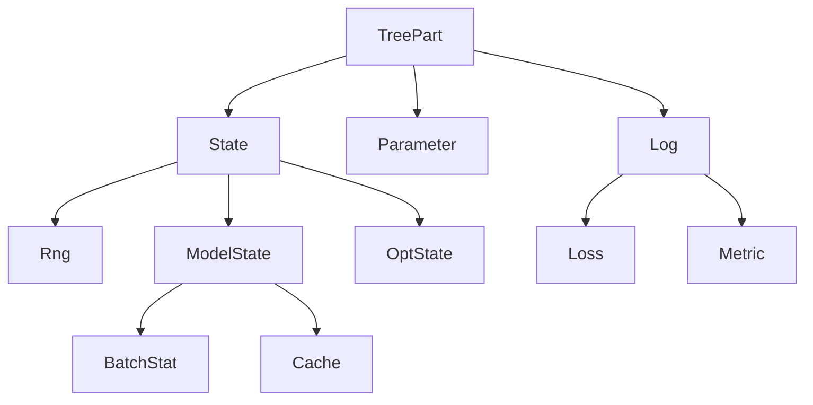

# Treex

_A Pytree Module system for Deep Learning in JAX_

* **Intuitive**: Modules are simple Python objects that respect Object-Oriented semantics and should make PyTorch users feel at home, with no need for separate dictionary structures or complex `apply` methods.
* **Pytree-based**:  Modules are registered as JAX PyTrees, enabling their use with any JAX function. No need for specialized versions of `jit`, `grad`, `vmap`, etc.
* **Expressive**: In Treex you use type annotations to define what the different parts of your module represent (submodules, parameters, batch statistics, etc), this leads to a very flexible and powerful state management solution.
* **Flax-based Implementations**: Writing high-quality, battle-tested code for common layers is hard. For this reason Modules in `treex.nn` are wrappers over their Flax counterparts. We keep identical signatures, enabling Flax users to feel at home but still benefiting from the simpler Pytorch-like experience Treex brings.

Treex is implemented on top of [Treeo](https://github.com/cgarciae/treeo). All of Treeo's public API is also available through Treex.

[Documentation](https://cgarciae.github.io/treex) | [Guide](#guide)

## Why Treex?
Despite all JAX benefits, current Module systems are not intuitive to new users and add additional complexity not present in frameworks like PyTorch or Keras. Treex takes inspiration from S4TF and delivers an intuitive experience using JAX Pytree infrastructure.

<details>
<summary>Current Alternative's Drawbacks and Solutions</summary>

Currently we have many alternatives like Flax, Haiku, Objax, that have one or more of the following drawbacks:

* Module structure and parameter structure are separate, and parameters have to be manipulated around by the end-user, which is not intuitive. In Treex, parameters are stored in the modules themselves and can be accessed directly.
* Monadic architecture adds complexity. Flax and Haiku use an `apply` method to call modules that set a context with parameters, rng, and different metadata, which adds additional overhead to the API and creates an asymmetry in how Modules are being used inside and outside a context. In Treex, modules can be called directly.
* Among different frameworks, parameter surgery requires special consideration and is challenging to implement. Consider a standard workflow such as transfer learning, transferring parameters and state from a  pre-trained module or submodule as part of a new module; in different frameworks, we have to know precisely how to extract their parameters and how to insert them into the new parameter structure/dictionaries such that it is in agreement with the new module structure. In Treex, just as in PyTorch / Keras, we enable to pass the (sub)module to the new module, and parameters are automatically added to the new structure.
* Multiple frameworks deviate from JAX semantics and require particular versions of `jit`, `grad`, `vmap`, etc., which makes it harder to integrate with other JAX libraries. Treex's Modules are plain old JAX PyTrees and are compatible with any JAX library that supports them.
* Other Pytree-based approaches like Parallax and Equinox do not have a total state management solution to handle complex states as encountered in Flax. Treex has the Filter and Update API, which is very expressive and can effectively handle systems with a complex state.

</details>

## Installation
Install using pip:
```bash
pip install treex
```

## Status
Treex is in an early stage, things might brake between versions but we will respect semanting versioning. While more testing is needed, since Treex layers are numerically equivalent to Flax this borrows some maturity and yields more confidence over its results. Feedback is much appreciated.

**Roadmap**:
- [x] Finish prototyping core API
- [ ] Wrap all Flax Linen Modules
- [x] Document public API
- [x] Create documentation site


## Getting Started
This is a small appetizer to give you a feel for how using Treex looks like, be sure to checkout the [Guide section](#guide) below for details on more advanced usage.
```python
from typing import Sequence, List

import jax
import jax.numpy as jnp
import numpy as np
import treex as tx

# you can use tx.MLP but we will create our own as an example
class MLP(tx.Module):
    layers: List[tx.Linear]

    def __init__(self, features: Sequence[int]):
        self.layers = [
            tx.Linear(din, dout) 
            for din, dout in zip(features[:-1], features[1:])
        ]

    def __call__(self, x):
        for linear in self.layers[:-1]:
            x = jax.nn.relu(linear(x))
        return self.layers[-1](x)

@jax.jit
@jax.grad
def loss_fn(model, x, y):
    y_pred = model(x)
    return jnp.mean((y_pred - y) ** 2)

# in reality use optax
def sdg(param, grad):
    return param - 0.01 * grad

model = MLP([1, 12, 8, 1]).init(42)

x = np.random.uniform(-1, 1, size=(100, 1))
y = 1.4 * x ** 2 - 0.3 + np.random.normal(scale=0.1, size=(100, 1))

# training loop
for step in range(10_000):
    grads = loss_fn(model, x, y)
    model = jax.tree_map(sdg, model, grads)

model = model.eval()
y_pred = model(x)
```

## Guide
### Defining Modules
Treex Modules are implemented on top of [treeo.Tree](https://github.com/cgarciae/treeo), we recommend that you review the core concepts of Treeo but we will provide a brief overview of how to define your own modules. Some terminology:

* Type annotation are type you set in a class variable after the `:` symbol.
* Field declarations are class variables whose default value is assigned with `tx.field`. Under the hood these are `dataclass.Field` instances.

For example:

```python
class MyModule(tx.Module):
    #  field     annotation   -----------declaration-------------
    #    v          v         v                                  v
    some_field: jnp.ndarray = tx.field(node=True, kind=tx.Parameter)
    #                                     ^                ^
    #                                node status       field kind
```
Here if `node=False` it would mean that the field is static, else is a node. The previous can be written more compactly as:

```python
class MyModule(tx.Module):
    some_field: jnp.ndarray = tx.Parameter.node()
```

Treex Modules follow this recipe:
* They inherit from `tx.Module`.
* Parameter-like fields are declared with a `tx.TreePart` subclass kind e.g. `tx.Parameter.node()`
* Hyper-parameters fields are usually don't contain a declaration so they are static.
* Submodules fields are not declared, instead the users provides type annotations that Treeo use to can infer the field as a node.
* Treex Modules can be defined as dataclasses or regular classes without any limitations.

For example, basic Modules will tend to look like this:

```python
class Linear(tx.Module):
    # din: int # annotation not needed, inferred as static
    w: tp.Union[tx.Initializer, jnp.ndarray] = tx.Parameter.node() # node field
    b: jnp.ndarray = tx.Parameter.node() # node field

    def __init__(self, din, dout):
        self.w = tx.Initializer(
            lambda key: jax.random.uniform(key, shape=(din, dout)))
        self.b = jnp.zeros(shape=(dout,))

    def __call__(self, x):
        return jnp.dot(x, self.w) + self.b

linear = Linear(3, 5).init(42)
y = linear(x)
```
While composite Modules will tend to look like this:

```python
class MLP(tx.Module):
    # features: Sequence[int], annotation not needed, infered as static
    layers: List[tx.Linear] # mandatory annotation, infered as node because Modules are treeo.Trees

    def __init__(self, features: Sequence[int]):
        self.layers = [
            tx.Linear(din, dout) 
            for din, dout in zip(features[:-1], features[1:])
        ]

    def __call__(self, x):
        for linear in self.layers[:-1]:
            x = jax.nn.relu(linear(x))
        return self.layers[-1](x)

mlp = MLP([3, 5, 2]).init(42)
```

### Predefined Layers
The `treex.nn` module contains a number of pre-defined layers which can be used to create more complex models:
```
BatchNorm
Conv
Dropout
FlaxModule
Linear
MLP
Lambda
Sequential
sequence
```
Check them out in the (API Reference)[https://cgarciae.github.io/treex/] section of the documentation. All modules and functions from `treex.nn` are also available on the base `treex` module so e.g. you can use `tx.Conv` and `tx.BatchNorm`.

### Treex Kinds
The role of each field is defined by its kind. While any valid kind is just a type, the default annotations from Treex are organized into the following hierarchy:

<details>
<summary>Graph code</summary>



</details>

<!-- Uncomment to test during development -->
<!--  -->


This is useful because you can make specific or more general queries using `filter` depending on what you want to achive. e.g.

```python
rngs = model.filter(tx.Rng)
batch_stats = model.filter(tx.BatchStat)
all_states = model.filter(tx.State)
```

### Initialization
Initialization in Treex is done by calling the `init` method on the Module with a seed. This returns a new Module with all fields initialized.

There are two initialization mechanisms in Treex. The first one is setting the fields we wish to initialize to an `Initializer` object. `Initializer`s contain functions that take a `key` and return the initial value of the field:
```python
class MyModule(tx.Module):
    a: Union[tx.Initializer, jnp.ndarray] = tx.Parameter.node()
    b: int = tx.node() # we are not setting a kind for this field for no reason

    def __init__(self):
        self.a = tx.Initializer(
            lambda key: jax.random.uniform(key, shape=(1,)))
        self.b = 2

module = MyModule() 
module # MyModule(a=Initializer, b=2)
moduel.initialized # False

module = module.init(42)  
module # MyModule(a=array([0.034...]), b=2)
module.initialized # True
```
The second is to override the `rng_init` method, which takes a unique `key` derived from the seed passed to `init` and can initialize any required fields. This is useful for modules that require complex initialization logic or whose field's initialization depends on each other.
```python
class MyModule(tx.Module):
    a: Union[jnp.ndarray, tx.Initializer] = tx.Parameter.node()
    b: Union[jnp.ndarray, None] = tx.Parameter.node()

    def __init__(self):
        self.a = tx.Initializer(
            lambda key: jax.random.uniform(key, shape=(1,)))
        self.b = None

    def rng_init(self, key):
        # self.a is already initialized at this point
        self.b = 10.0 * self.a + jax.random.normal(key, shape=(1,))

module = MyModule().init(42)
module # MyModule(a=array([0.3]), b=array([3.2]))
```
As shown here, field `Initializer`s are always called before `rng_init`.

### Basic API
Throught these examples for the functional API we will use the following defintions:
```python
@dataclass
class MyModule(tx.Module):
    a: jnp.ndarray = tx.Parameter.node()
    b: jnp.ndarray = tx.BatchStat.node()
```
#### Filter
The `Module.filter` method allows you to select a subtree by filtering based on a `kind`, all leaves whose field kind is a subclass of such type are kept, the rest are set to a special `Nothing` value.
```python
module = MyModule(a=1, b=2)

module.filter(tx.Parameter) # MyModule(a=1, b=Nothing)
module.filter(tx.BatchStat) # MyModule(a=Nothing, b=2)
```
Since `Nothing` is an empty Pytree it gets ignored by tree operations, this effectively allows you to easily operate on a subset of the fields:

```python
jax.tree_map(lambda x: -x, module.filter(tx.Parameter)) # MyModule(a=-1, b=Nothing)
jax.tree_map(lambda x: -x, module.filter(tx.BatchStat)) # MyModule(a=Nothing, b=-2)
```
#### shortcuts
As simple filters getting the standard TreePart types are often enough, some shortcuts are provided, the first filter example can be written as:
```python
module.parameters()  # MyModule(a=1, b=Nothing)
module.batch_stats() # MyModule(a=Nothing, b=2)
```
Here is the full list of shortcuts:

| Shortcut          | Equivalence              |
| ----------------- | ------------------------ |
| `.parameters()`   | `.filter(tx.Parameter)`  |
| `.batch_stats()`  | `.filter(tx.BatchStat)`  |
| `.rngs()`         | `.filter(tx.RNG)`        |
| `.model_states()` | `.filter(tx.ModelState)` |
| `.states()`       | `.filter(tx.State)`      |
| `.metrics()`      | `.filter(tx.Metric)`     |
| `.losses()`       | `.filter(tx.Loss)`       |
| `.logs()`         | `.filter(tx.Log)`        |


##### filter predicates
If you need to do more complex filtering, you can pass callables with the signature `FieldInfo -> bool` instead of types:

```python
# all States that are not OptStates
module.filter(
    lambda field: issubclass(field.kind, tx.State) 
    and not issubclass(field.kind, tx.OptState)
) 
# MyModule(a=Nothing, b=2)
```
##### multiple filters
The previous could be abbreviated using multiple filters as its required that **all** filters pass for a field to be kept:
```python
module = MyModule(a=1, b=2)
# all States that are not OptStates
module.filter(
    tx.State,
    lambda field: not issubclass(field.kind, tx.OptState)
) 
# MyModule(a=Nothing, b=2)
```
The previous also be written as:
```python
module.states(lambda field: not issubclass(field.kind, tx.OptState))
```

#### Update
The `update` method allows you to merge the values of one or more incoming modules with the current module, this is useful for integrating filtered modules back into the main module.

```python
module = MyModule(a=1, b=2)
params = module.parameters() # MyModule(a=1, b=Nothing)
negative = jax.tree_map(lambda x: -x, params) # MyModule(a=-1, b=Nothing)
module = module.update(negative) # MyModule(a=-1, b=2)
```

#### Map
The `map` method provides a convenient way to map a function over the fields of a module:

```python
module = MyModule(a=1, b=2)
params = module.parameters() # MyModule(a=1, b=Nothing)
negative = params.map(lambda x: -x) # MyModule(a=-1, b=Nothing)
module = module.update(negative) # MyModule(a=-1, b=2)
```

Up to this point `map` is behaving just like `jax.tree_map`, however, the pattern in the previous example is so common that `map`s main use is providing a shortcut for applying `filter -> tree_map -> update` in sequence:

```python
module = MyModule(a=1, b=2)
module = module.map(lambda x: -x, tx.Parameter) # MyModule(a=-1, b=2)
```

As shown here, `map` accepts the same `*args` as `filter` and calls `update` at the end if filters are given.

#### Functional API
Treex exports all functions from Treeo's functional API, the following functions are available:
```python
tx.filter(obj: A, *filters: Filter) -> A
tx.update(module: A, other: A, *rest: A) -> A
tx.map(f: tp.Callable, obj: A, *filters: Filter) -> A
tx.apply(f: tp.Callable, obj: A, *rest: A, inplace: bool) -> A
```

#### Use cases
##### grad & optimizers
A typical use case is to define `params` as a `Parameter` filter and pass it as the first argument to `grad` or `value_and_grad` and as the target to optimizers:

```python
params = model.parameters()

optimizer = tx.Optimizer(optax.adam(1e-3))
optimizer = optimizer.init(params)

@jax.grad 
def loss_fn(params, model, x, y):
    # update traced arrays by `grad` from `params`
    model = model.update(params)
    ...

grads = loss_fn(params, model, x, y)
params = optimizer.update(grads, params)
```
Note that inside `loss_fn` the `params` are immediately merged back into `model` via `update` so they are used in the actual computation.

##### Sychronizing Distributed State
`filter` can also be used to synchronize specific state like batch statistics (BatchNorm) in distributed (pmap-ed) functions:

```python
# assume we are inside a pmap with axis_name="device"
batch_stats = model.batch_stats()
batch_stats = jax.lax.pmean(batch_stats, axis_name="device")
model = model.update(batch_stats)
```

The previous is roughly equivalent to:

```python
model = model.map(lambda x: jax.lax.pmean(x, axis_name="device"), tx.BatchStat)
```

However, this applies `pmean` to the leaves instead of the whole tree which may or may not be desirable.

### Optimizer

Optax is an amazing library however, its optimizers are not pytrees, this means that their state and computation are separate and you cannot jit them. To solve this Treex provides a `tx.Optimizer` class that can wrap any Optax optimizer.

While in optax you would define something like this:
```python
def main():
    ...
    optimizer = optax.adam(1e-3)
    opt_state = optimizer.init(params)
    ...

@partial(jax.jit, static_argnums=(4,))
def train_step(model, x, y, opt_state, optimizer): # optimizer has to be static
    ...
    updates, opt_state = optimizer.update(grads, opt_state, params)
    params = optax.apply_updates(params, updates)
    ...
    return model, loss, opt_state
```

With `tx.Optimizer` you it can be simplified to:

```python
def main():
    ...
    optimizer = tx.Optimizer(optax.adam(1e-3)).init(params)
    ...

jax.jit # no static_argnums needed
def train_step(model, x, y, optimizer):
    ...
    params = optimizer.update(grads, params)
    ...
    return model, loss, optimizer
```

As you see, `tx.Optimizer` follows a similar API as `optax.GradientTransformation` except that:
1. There is no `opt_state`, instead optimizer IS the state.
2. `update` applies the update the parameters, if you want the `updates` instead you can set `apply_updates=False`.
3. `update` also updates the internal state of the optimizer in-place.

Notice that since `tx.Optimizer` is a Pytree it was passed through `jit` naturally without the need to specify `static_argnums`.

### State Management
Treex takes a "direct" approach to state management, i.e., state is updated in-place by the Module whenever it needs to. For example, this module will calculate the running average of its input:
```python
class Average(tx.Module):
    count: jnp.ndarray = tx.State.node()
    total: jnp.ndarray = tx.State.node()

    def __init__(self):
        self.count = jnp.array(0)
        self.total = jnp.array(0.0)

    def __call__(self, x):
        self.count += np.prod(x.shape)
        self.total += jnp.sum(x)

        return self.total / self.count
```
Treex Modules that require random state will often keep a `rng` key internally and update it in-place when needed:
```python
class Dropout(tx.Module):
    key: jnp.ndarray = tx.Rng.node()

    def __init__(self, key: jnp.ndarray):
        self.key = key
        ...

    def __call__(self, x):
        key, self.key = jax.random.split(self.key)
        ...
```
Finally `tx.Optimizer` also performs inplace updates inside the `update` method, here is a sketch of how it works:
```python
class Optimizer(tx.Module):
    opt_state: Any = tx.OptState.node()
    optimizer: optax.GradientTransformation

    def update(self, grads, params):
        ...
        updates, self.opt_state = self.optimizer.update(
            grads, self.opt_state, params
        )
        ...
```
#### What is the catch?
<!-- TODO: Add a list of rules to follow around jitted functions -->
State management is one of the most challenging things in JAX, but with the help of Treex it seems effortless, what is the catch? As always there is a trade-off to consider: Treex's approach requires to consider how to propagate state changes properly while taking into account the fact that Pytree operations create new objects, that is, since reference do not persist across calls through these functions changes might be lost. 

A standard solution to this problem is: **always output the module to update state**. For example, a typical loss function that contains a stateful model would look like this:

```python
@partial(jax.value_and_grad, has_aux=True)
def loss_fn(params, model, x, y):
    model = model.update(params)

    y_pred = model(x)
    loss = jnp.mean((y_pred - y) ** 2)

    return loss, model

params = model.parameters()
(loss, model), grads = loss_fn(params, model, x, y)
...
```
Here `model` is returned along with the loss through `value_and_grad` to update `model` on the outside thus persisting any changes to the state performed on the inside.


### Training State
Treex Modules have a `training: bool` property that specifies whether the module is in training mode or not. This property conditions the behavior of Modules such as `Dropout` and `BatchNorm`, which behave differently between training and evaluation. 

To switch between modes, use the `.train()` and `.eval()` methods, they return a new Module whose `training` state and the state of all of its submodules (recursively) are set to the desired value.

```python
# training loop
for step in range(1000):
    loss, model, opt_state = train_step(model, x, y, opt_state)

# prepare for evaluation
model = model.eval()

# make predictions
y_pred = model(X_test)
```

### Freezing Layers
Similar to `.training`, Treex `Module`s have a `.frozen` property that specifies whether the module is frozen or not. This property is used to condition the behavior of modules such as `Dropout` and `BatchNorm` which will behave deterministically/statically when `frozen=True`. Freezing layers is useful for tasks such as Transfer Learning where you want to freeze most of the weights of a model and train only a few of them on a new dataset.

To switch between modes, use the `.freeze()` and `.unfreeze()` methods, they return a new Module whose `frozen` state and the state of all of its submodules (recursively) are set to the desired value.

For example, you can leverage the fact that `Sequential` has its submoules in a `layers: List[Module]` field to freeze the first few layers of a model:

```python
class ConvBlock(tx.Module):
    ...

model = tx.Sequential(
    ConvBlock(3, 32),
    ConvBlock(32, 64),
    ConvBlock(64, 128),
    ...
)

# train model
...

# freeze some layers
for layer in model.layers[:-1]:
    layer.freeze(inplace=True)

# fine-tune the model
...
```

If you have a backbone you can just freeze the entire model:

```python
backbone = get_pretrained_model()
backbone = backbone.freeze()

model = tx.Sequential(
    backbone,
    tx.Linear(backbone.output_features, 10)
).init(42)

...

@jax.jit
def train_step(model, x, y, optimizer):
    # only differentiate w.r.t. parameters whose module is not frozen
    params = model.filter(
        tx.Parameter,
        lambda field: not field.module.frozen,
    )
    (loss, model), grads = loss_fn(params, model, x, y)

    ...
```


### Full Example

```python
from functools import partial
import jax
import jax.numpy as jnp
import matplotlib.pyplot as plt
import numpy as np
import optax
import treex as tx

x = np.random.uniform(size=(500, 1))
y = 1.4 * x - 0.3 + np.random.normal(scale=0.1, size=(500, 1))

# treex already defines tx.Linear but we can define our own
class Linear(tx.Module):
    w: tx.Parameter[tx.Initializer, jnp.ndarray]
    b: tx.Parameter[jnp.ndarray]

    def __init__(self, din, dout):
        self.w = tx.Initializer(lambda key: jax.random.uniform(key, shape=(din, dout)))
        self.b = jnp.zeros(shape=(dout,))

    def __call__(self, x):
        return jnp.dot(x, self.w) + self.b


model = Linear(1, 1).init(42)
optimizer = tx.Optimizer(optax.adam(0.01))
optimizer = optimizer.init(model.paramerters())


@partial(jax.value_and_grad, has_aux=True)
def loss_fn(params, model, x, y):
    model = model.update(params)

    y_pred = model(x)
    loss = jnp.mean((y_pred - y) ** 2)

    return loss, model


@jax.jit
def train_step(model, x, y, optimizer):
    params = model.paramerters()
    (loss, model), grads = loss_fn(params, model, x, y)

    # here model == params
    model = optimizer.update(grads, model)

    return loss, model, optimizer


for step in range(1000):
    loss, model, optimizer = train_step(model, x, y, optimizer)
    if step % 100 == 0:
        print(f"loss: {loss:.4f}")

model = model.eval()

X_test = np.linspace(x.min(), x.max(), 100)[:, None]
y_pred = model(X_test)

plt.scatter(x, y, c="k", label="data")
plt.plot(X_test, y_pred, c="b", linewidth=2, label="prediction")
plt.legend()
plt.show()
```
